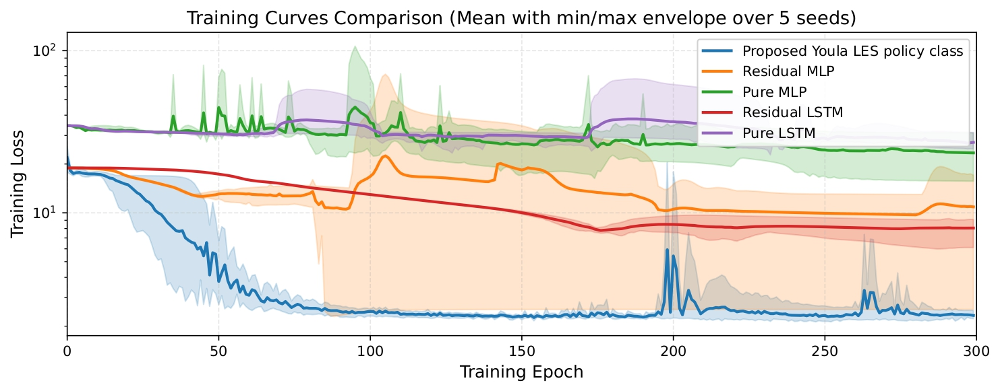
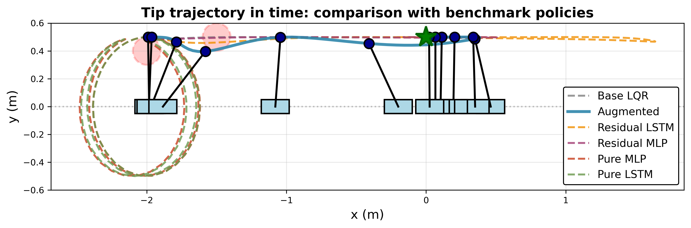

# Learning Locally Exponentially Stabilizing Policies via Residual Youla Dynamics around Linear State Feedback

This repository contains the code, figures, and animations associated with the paper:

> **“Learning Locally Exponentially Stabilizing Policies via Residual Youla Dynamics around Linear State Feedback”**  
> Luca Furieri

The paper derives a **state-space characterization of all dynamic state-feedback controllers** that render an equilibrium of a nonlinear input-affine continuous-time system **locally exponentially stable**.Any such controller can be written as:
- a linear baseline controller \(u(t) = Kx(t)\) (designed on the linearization),  
- plus **free nonlinear controller dynamics** that are themselves locally exponentially stable in suitable coordinates.

The paper illustrates the approach on a **cart–pendulum obstacle-avoidance task**, showing improved performance compared with standard RL and residual-RL policy classes of comparable size. 

-----

## Animation

----
## Training curves and comparisons

